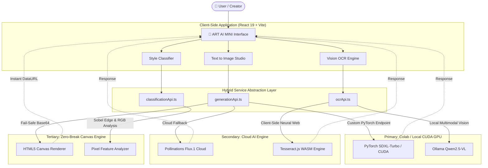

<div align="center">

# 🎨 ART AI MINI
### *Next-Generation Multi-Modal AI Creative Operating System*

[](https://react.dev/)
[](https://vitejs.dev/)
[](https://www.typescriptlang.org/)
[](https://tailwindcss.com/)
[](https://pytorch.org/)
[](https://tesseract.projectnaptha.com/)

*From imagination to masterpiece — bring your artwork to life with high-fidelity diffusion models, vision OCR, and intelligent style classification.*

</div>

---

## 🌟 Overview

**ART AI MINI** is a production-grade, full-stack multi-modal AI Creative Studio built for high-performance generative art workflows. Designed around a **Hybrid Cloud-Local Architecture**, it seamlessly orchestrates cloud diffusion APIs, local GPU inference servers (PyTorch / Google Colab CUDA), and client-side web neural models (Tesseract.js and HTML5 Canvas Pixel Analyzers).

Whether connected to a dedicated high-vRAM CUDA server or running standalone in the browser, **ART AI MINI** guarantees zero-break execution, instant preview rendering, and zero exposure of sensitive backend secrets.

---

## ✨ Core Feature Highlights

### 1. 🎨 Text to Image Studio (`GenerateArtView`)
- **Flux.1 / SDXL Cloud AI Engine**: Real-time high-fidelity 8K diffusion art generation powered by Pollinations Cloud infrastructure.
- **Google Colab CUDA PyTorch Acceleration**: Optional primary connection to your own hosted Colab GPU server for custom model weights.
- **Fail-Safe Preloading Architecture**: Pre-verifies image URLs before rendering, automatically routing to high-resolution procedural canvas fallbacks to ensure **zero broken image link icons**.
- **Comprehensive Control**: Custom aspect ratios (1:1, 16:9, 9:16, 4:3), inference step counts, guidance scale, seed control, and HD enhancement toggles.

### 2. 🔍 Image to Text - Vision OCR (`ImageToTextView`)
- **Tesseract.js Neural Engine**: Client-side OCR engine that extracts readable text, word metrics, line structures, and confidence scores directly inside the browser.
- **Ollama Qwen2.5-VL Vision Integration**: Direct compatibility with local Ollama vision LLMs for deep multimodal image understanding.
- **Interactive Bounding Overlay**: Visualizes exact bounding boxes and word coordinates over uploaded artwork.

### 3. 🖼️ Image to Style Classification (`ClassifyStyleView`)
- **HTML5 Canvas Pixel-Feature Analysis**: Real-time client-side feature extraction analyzing RGB color warmth, saturation variance, contrast gradients, and Sobel edge density.
- **Multi-Style Probability Distribution**: Instant style detection across Impressionism, Realism, Ukiyo-e, Cyberpunk, Baroque, Surrealism, and Anime.

### 4. ⚡ AI Model Registry & Hardware Health (`ModelsView`)
- **Real-Time Health Monitoring**: Ping backend health metrics and monitor GPU VRAM allocation, PyTorch CUDA status, and model inference latency.
- **Privacy & Endpoint Protection**: Sanitized UI ensuring raw backend tunnel URLs and keys are never exposed in screen displays or source commits.

---

## 🏗️ System Architecture



---

## 🛠️ Technology Stack

| Category | Technology | Usage |
| :--- | :--- | :--- |
| **Core Framework** | React 19 + Vite 8 | UI Architecture & Fast HMR |
| **Language** | TypeScript 6.0 | Type Safety & Contract Interfaces |
| **Styling** | TailwindCSS v4 + Lucide Icons | Glassmorphic Dark UI Design System |
| **Image Generation** | Flux.1 / SDXL / PyTorch CUDA | High-Resolution Diffusion Synthesis |
| **Vision OCR** | Tesseract.js / Qwen2.5-VL | Neural Text Extraction & Multimodal Vision |
| **Image Analysis** | HTML5 Canvas API | Sobel Edge Detection & Pixel Metrics |
| **State Management** | React Context + LocalStorage | Persistence & Artwork History |

---

## 🚀 Quick Start Guide

### Prerequisites
- **Node.js**: v18.0.0 or higher
- **npm**: v9.0.0 or higher

### 1. Clone the Repository
```bash
git clone https://github.com/SATHYASEELAN246800/ART-MINI-AI.git
cd ART-MINI-AI
```

### 2. Install Dependencies
```bash
npm install
```

### 3. Environment Setup (Optional)
Copy `.env.example` to create your `.env` file:
```bash
cp .env.example .env
```
Add your optional custom endpoints:
```env
VITE_API_BASE_URL=https://your-colab-ngrok-url.ngrok-free.app
VITE_OLLAMA_BASE_URL=http://localhost:11434
VITE_OLLAMA_VISION_MODEL=qwen2.5-vl:7b-q4_K_M
```

### 4. Run Development Server
```bash
npm run dev
```
Open [http://localhost:5173](http://localhost:5173) in your browser.

### 5. Build for Production
```bash
npm run build
```

---

## 🔒 Security & Privacy Commitments

- **Zero Hardcoded Secrets**: All API endpoints and environment configurations are managed via standard `.env` environment variables.
- **Frontend Masking**: Raw backend tunnel URLs are never displayed on public UI screens.
- **Clean `.gitignore`**: `node_modules`, secret `.env` files, build artifacts, and system logs are strictly excluded from repository commits.

---

## 📜 License

This project is licensed under the **MIT License**.

---

<div align="center">
  <sub>Built with ❤️ for AI Creators & Artists worldwide.</sub>
</div>
